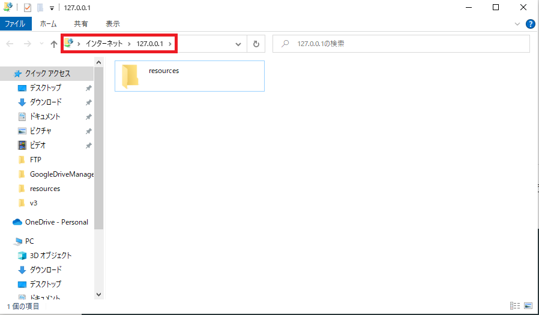

# FTPサーバーとは

FTP(File Transfer Protocol：ファイル転送プロトコル)を利用してファイルの送受信を行うサーバーソフトウェア。
またそのようなソフトが動いているサーバーPC。

→ つまりリソース鯖として使えるのでは？
ということでDockerでContainerを立ててリソース鯖として運用してみる。

# 概要

UnityClientで使用するリソース(AssetBundleなど)をFTPサーバーにアップロードし
クライアントのランタイムでダウンロードしてみる。

# 導入

## FTPサーバーへのアクセス.

エクスプローラーにて`ftp://<PUBLICHOSTで指定したホストIP>`を指定することでアクセス可能.<br>
例:
```
ftp://127.0.0.1/
```



F5使えないみたいなので更新は右クリック「最新の情報に更新」を選択。


`resources`フォルダをFTPサーバーにマウントしてる。


# 参考
https://ts0818.hatenablog.com/entry/2017/06/17/165731